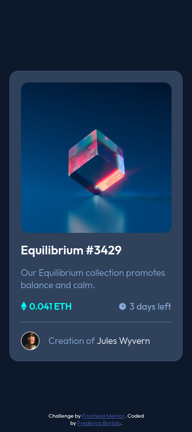
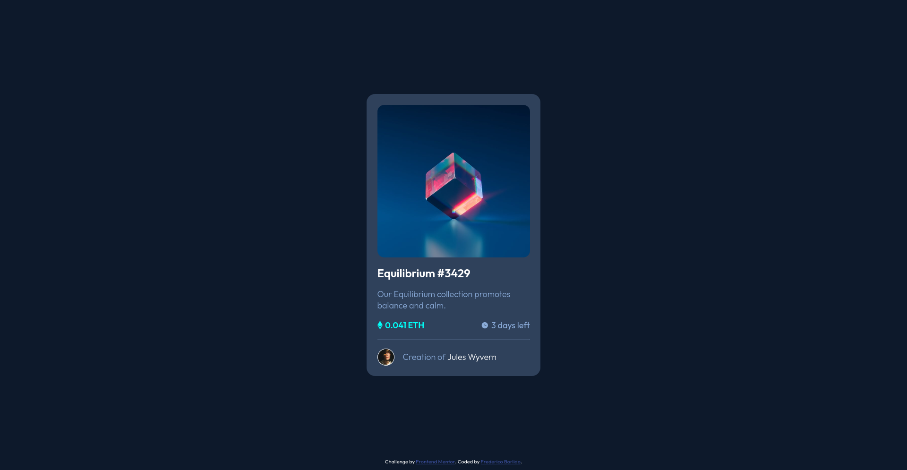

# Frontend Mentor - NFT preview card component solution

This is a solution to the [NFT preview card component challenge on Frontend Mentor](https://www.frontendmentor.io/challenges/nft-preview-card-component-SbdUL_w0U). Frontend Mentor challenges help you improve your coding skills by building realistic projects.

## Table of contents

- [Overview](#overview)
  - [The challenge](#the-challenge)
  - [Screenshot](#screenshot)
  - [Links](#links)
- [My process](#my-process)
  - [Built with](#built-with)
- [Author](#author)

## Overview

### The challenge

Users should be able to:

- View the optimal layout depending on their device's screen size
- See hover states for interactive elements

### Screenshot

- Mobile: 
- Desktop: 

### Links

- [Solution URL](https://github.com/fborlido/fm-nft)
- [Live Site URL](https://fborlido.github.io/fm-nft)

## My process

### Built with

- Semantic HTML5 markup
- Sass
- Flexbox
- CSS Grid

## Author

- Website - [Frederico Borlido](https://www.github.com/fborlido)
- Frontend Mentor - [@fborlido](https://www.frontendmentor.io/profile/fborlido)
